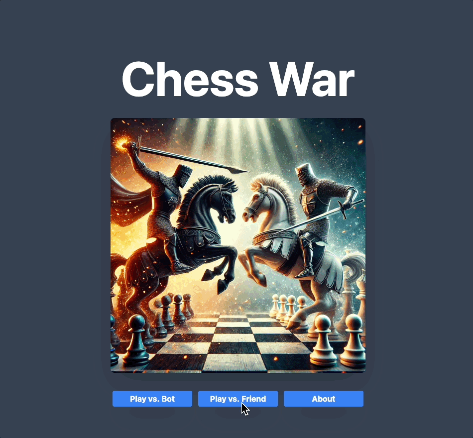

# Chess War

## Overview

Chess War is an innovative fusion between the classic card game of War and the pieces and values from Chess. Combining traditional chess values with exciting battle mechanics, players face off in a an unpredictable head-to-head match, either against a computer or a friend (coming soon!).

Players can select custom avatars, track scores, and engage in thrilling battles where chess pieces are randomly assigned battle values. The ultimate goal? Dominate the board and claim victory!

## Planning

[Figma](https://www.figma.com/board/eyjvUoMaelsgtV4hCH1q8Z/Chess-War?node-id=0-1&p=f&t=EPjosJRO9Er1HrC8-0)
[Github project board](https://github.com/users/jimmacur/projects/15/views/1)

## Features

- **Battle Mechanics:** Chess pieces receive randomized battle values within their classical range, adding an element of unpredictability to the game.
- **Custom Avatars:** Select from a variety of fun and themed chess avatars to represent your style.
- **Real-Time Score Tracking:** Stay updated as scores dynamically change throughout the game.
- **Interactive UI:** Built with Vue and Tailwind CSS for a seamless user experience.
- **Responsive Design:** Ensures an optimized experience across devices, from desktop to mobile.
- **Error Handling:** Ensures that the features of User Name, selected pieces, and avatar create a seamless user experience

### Gameplay Preview

*Enjoy the exciting game play of **Chess War**!*

### Responsive Design

## Technologies learned

This project marked my first experience working with VueJS, and I’ve grown to appreciate several aspects of the framework:

- Component Organization: Vue’s structure, with clear separation between templates, scripts, and styles, made development intuitive and efficient.
- State Management: Vue’s Composition API provided a powerful yet easy-to-use way to manage and share state across components.
- Component Communication: Using props and hooks for communication between components felt seamless and logical.
- Routing: Vue Router made navigation and dynamic routing simple and efficient.

## Technologies Used

[![Vue.js][Vue.js]][Vue-url]

[![TypeScript][Typescript]][Typescript-url]

[![Tailwind CSS][Tailwind]][Tailwind-url]

## Installation

1. Clone this repo

    `git clone https://github.com/yourusername/chess-war.git`

2. Navigate to the directory

    `cd chess-war`

3. `npm install`
4. `npm run dev`
5. open you browser to [localhost:3000](http://localhost:3000)
6. Enjoy your game!!

## Future enhancements

- Multiplayer mode: Play live with friends through real-time connections.
- Queen promotion: Add strategic depth by allowing pawn promotion under specific criteria.
- More avatars: Expand the avatar selection with new themes and styles.
- Difficulty levels: Introduce adjustable difficulty to challenge players of all skill levels.
- Animations and sounds: Introduce adjustable AI difficulty to challenge players of all skill levels.

## Contributors

### Jim Macur

- <jim.macur@gmail.com>
- [linkedIn](https://www.linkedin.com/in/jimmacur/)
- [portfolio](https://jim-macur-portfolio.vercel.app/)

## Acknowledgements

- A big thank you to [Lichess](https://lichess.org) for providing the beautiful SVGs of chess pieces used in this project. The chess piece assets are sourced from the open-source [Lichess GitHub repository](https://github.com/lichess-org/lila).  

[Vue.js]: https://img.shields.io/badge/Vue.js-35495E?style=for-the-badge&logo=vuedotjs&logoColor=4FC08D
[Vue-url]: https://vuejs.org/

[Typescript]: https://img.shields.io/badge/TypeScript-3178C6?style=for-the-badge&logo=typescript&logoColor=white
[Typescript-url]: https://www.typescriptlang.org/docs/

[Tailwind]: https://img.shields.io/badge/TailwindCSS-38B2AC?style=for-the-badge&logo=tailwindcss&logoColor=white
[Tailwind-url]: https://v2.tailwindcss.com/docs